# 3 & 4 — System Diagrams and Domain Model

All diagrams are **Mermaid** (render in GitHub/VS Code). They follow the **C4 model**
(Context → Container → Component → Deployment) plus Network and Security views.

---

## 3.1 System Context (C4 Level 1)

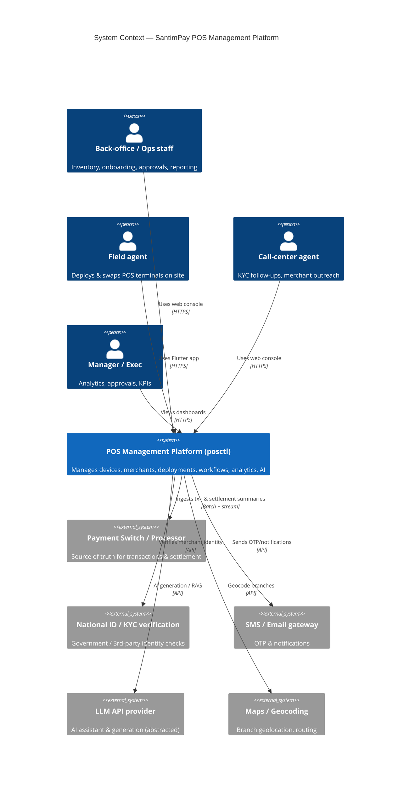

## 3.2 Container Diagram (C4 Level 2)

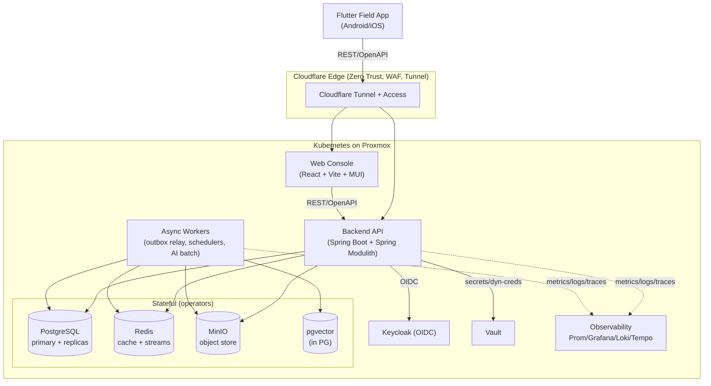

## 3.3 Component Diagram (C4 Level 3) — inside the Backend API

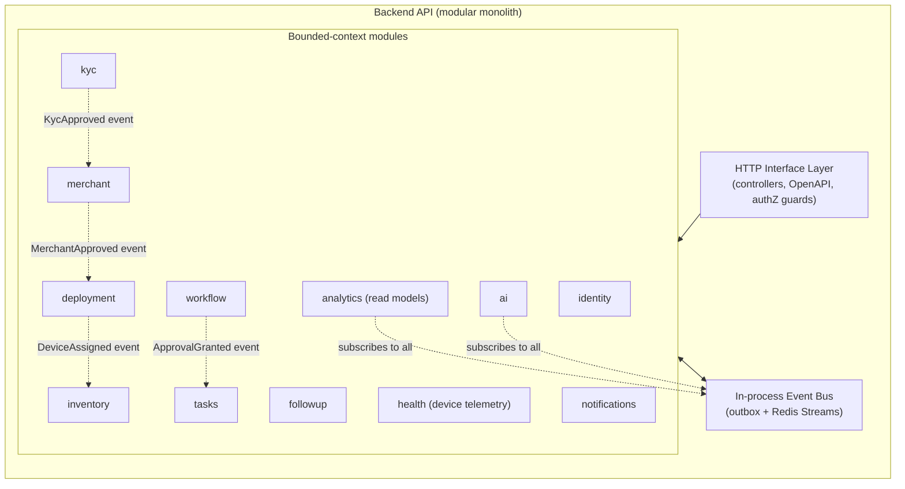

Each module internally follows Clean/Hexagonal layering:

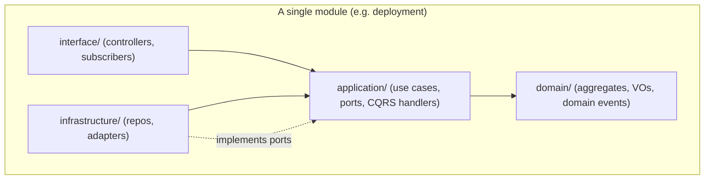

## 3.4 Deployment Diagram (C4 Level 4)

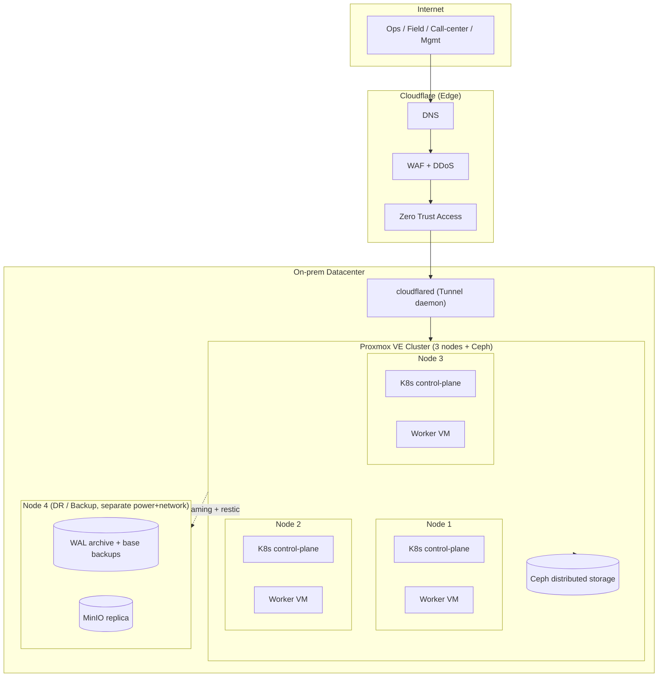

## 3.5 Network Diagram

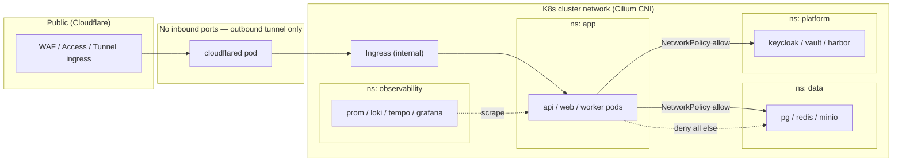

Key network rules:
- **Zero open inbound ports** on the firewall. All ingress is via the outbound-only Cloudflare
  Tunnel. The datacenter never exposes a public IP.
- **Default-deny NetworkPolicies** (Cilium); each namespace whitelists only required flows.
- **mTLS** between services via Vault-issued PKI (or a service mesh later — not on day one).
- Data namespace is reachable **only** from `app` namespace, never from ingress directly.

## 3.6 Security Diagram (trust zones & controls)

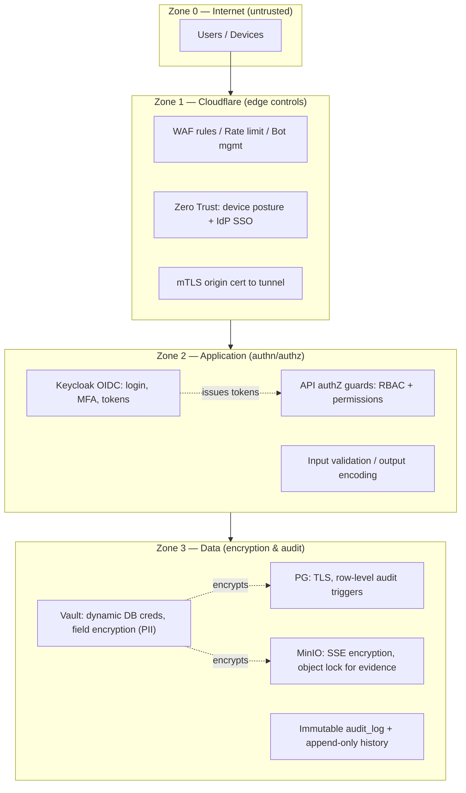

Defense-in-depth summary: edge (WAF/ZT) → identity (Keycloak+MFA) → app authZ (RBAC + fine-grained
permissions) → data (TLS, field-level encryption of PII via Vault transit, immutable audit). Full
control catalogue in [07-security-observability-dr.md](07-security-observability-dr.md).

---

## 4. Domain Model

### 4.1 Strategic DDD — Context Map

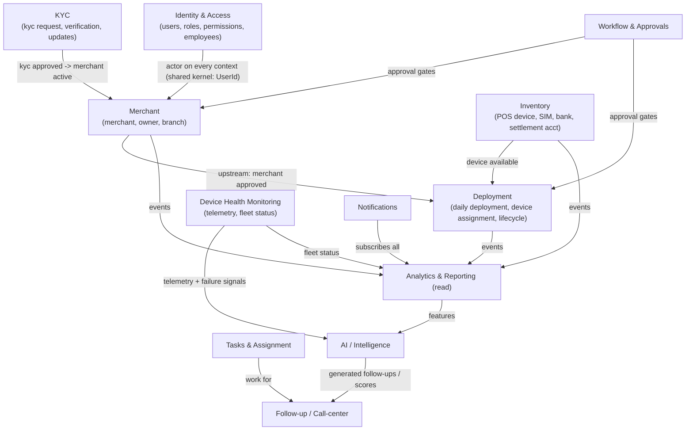

**Relationship patterns (context map):**
- `Identity` is a **Shared Kernel** for `UserId`/`EmployeeId` (just IDs + claims; no shared tables).
- `Merchant`, `Inventory`, `Workflow` are **upstream** to `Deployment` (Customer–Supplier).
- `Analytics` and `AI` are **downstream conformist** consumers of everyone's events (read-only).
- `KYC` ↔ external verification provider via an **Anti-Corruption Layer**.

### 4.2 Ubiquitous language (excerpt)
| Term | Meaning |
|---|---|
| **Merchant** | A business onboarded to accept payments via SantimPay. |
| **Merchant Owner** | Legal/beneficial owner; subject of KYC. |
| **Branch** | A physical location of a merchant where terminals operate. |
| **POS Device** | A physical terminal with a serial/IMEI, lifecycle state. |
| **SIM** | Connectivity SIM bound to a device for a period. |
| **Deployment** | The act/record of placing a device at a branch on a date. |
| **Device Assignment** | Current binding of a device → branch/merchant. |
| **KYC Request** | A unit of identity verification work with a state machine. |
| **Follow-up** | A call-center contact attempt with outcome. |
| **Task** | Assignable unit of work for an employee. |
| **Approval** | A workflow gate requiring an authorized decision. |

### 4.3 Tactical DDD — core aggregates

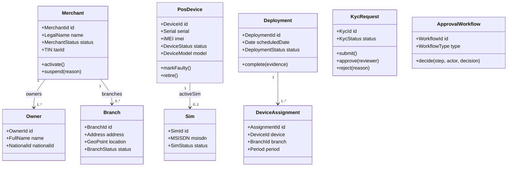

**Aggregate boundaries (invariants protected together):**
- `Merchant` aggregate = Merchant + Owners + Branches (a merchant cannot be active without ≥1
  approved owner and ≥1 branch). Large merchants → consider Branch as its own aggregate referenced
  by ID to avoid loading hundreds of branches; design uses **Branch as a separate aggregate** linked
  by `merchant_id` for exactly this scaling reason.
- `PosDevice` aggregate = device + its current SIM binding + lifecycle state machine.
- `Deployment` aggregate = the deployment plan + its device assignments for a date.
- `KycRequest`, `Task`, `FollowUp`, `ApprovalWorkflow` are each their own aggregate.

### 4.4 Key domain events (the integration contract between modules)
| Event | Producer | Primary consumers |
|---|---|---|
| `MerchantOnboarded` | merchant | kyc, analytics, notifications |
| `KycApproved` / `KycRejected` | kyc | merchant, workflow, notifications |
| `MerchantActivated` | merchant | deployment, analytics |
| `DeviceReceivedIntoStock` | inventory | analytics |
| `DeviceAssigned` / `DeviceUnassigned` | deployment | inventory, analytics |
| `DeploymentCompleted` | deployment | tasks, analytics, notifications |
| `DeviceMarkedFaulty` | inventory | deployment, tasks, ai |
| `ApprovalRequested` / `ApprovalGranted` / `ApprovalRejected` | workflow | requesting module, notifications |
| `TaskAssigned` / `TaskCompleted` | tasks | followup, analytics, notifications |
| `FollowUpLogged` | followup | analytics, ai |
| `TransactionSummaryIngested` | analytics | ai |
| `DeviceHealthReported` | health | analytics, ai (failure prediction) |
| `DeviceOfflineDetected` | health | tasks, followup, notifications |
| `KycChangeRequested` / `KycChangeApplied` | kyc | merchant, workflow, notifications |
| `RiskScoreComputed` / `HealthScoreComputed` | ai | merchant, followup, notifications |

### 4.5 Device lifecycle state machine (illustrative)

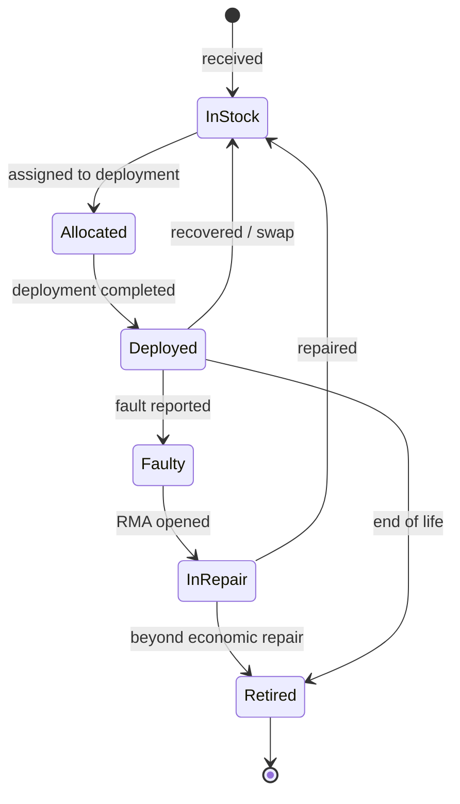

### 4.6 KYC request state machine

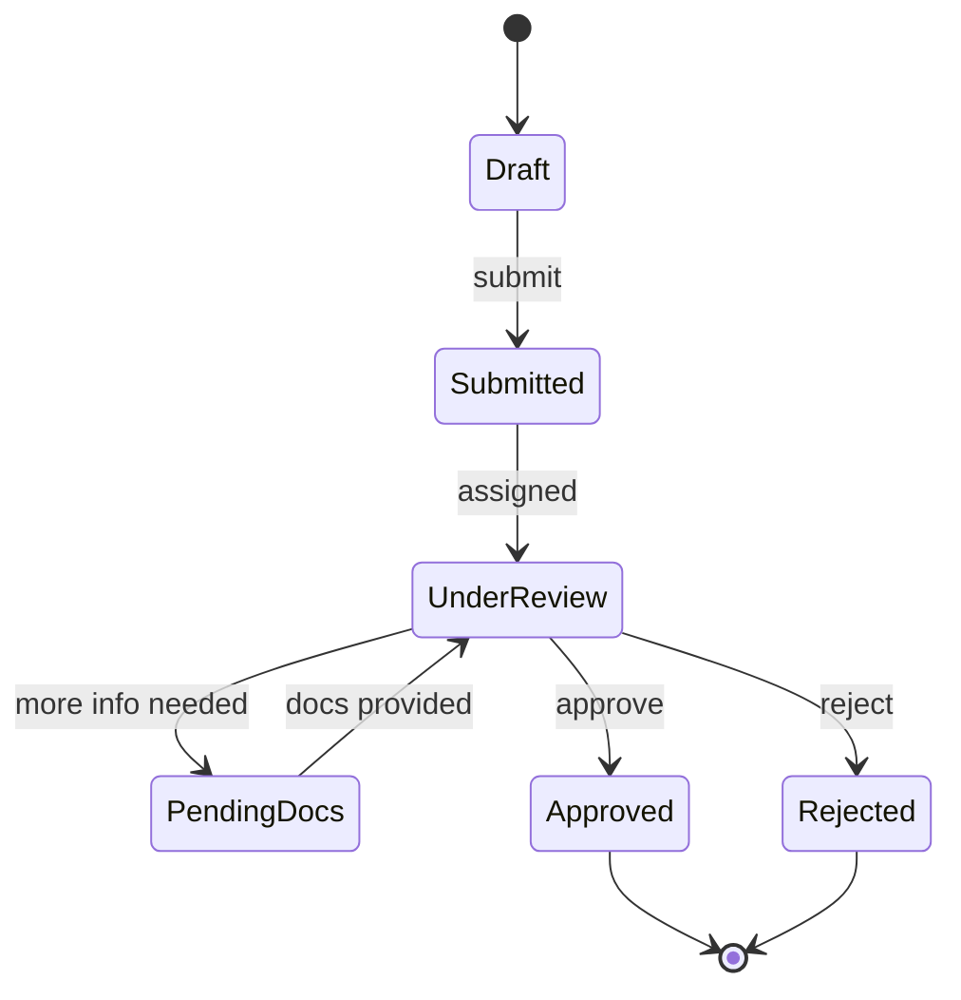
