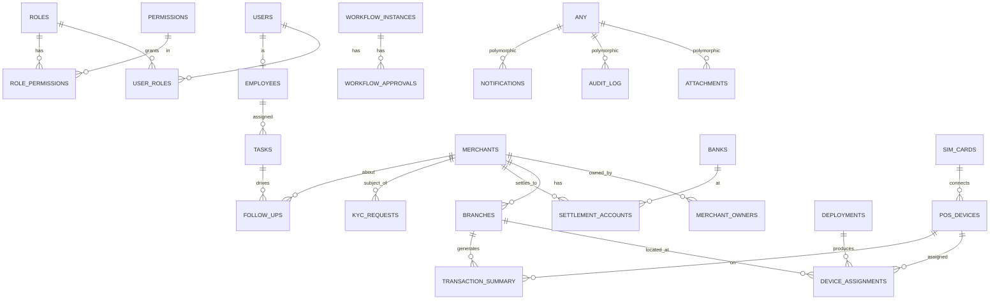

# 5 — Database Design

Full DDL: [../db/schema.sql](../db/schema.sql). This document explains the design choices.

## 5.1 Principles
- **One PostgreSQL cluster, schema-per-module** (`identity`, `merchant`, `inventory`, `deployment`,
  `kyc`, `tasks`, `workflow`, `followup`, `analytics`, `notification`, `ai`, `audit`). Mirrors the
  modular-monolith boundaries; makes future extraction a `pg_dump --schema` away.
- **No cross-schema foreign keys.** Cross-module links use the referenced ID + are kept consistent by
  events. Within a schema, full referential integrity with FKs and constraints.
- **UUID v7 primary keys** (`uuid_generate_v7()` / time-ordered) — globally unique, index-friendly,
  safe to expose, merge-friendly across future services.
- **Soft deletes** via `deleted_at TIMESTAMPTZ NULL` + partial indexes `WHERE deleted_at IS NULL`.
  Hard delete only for GDPR/right-to-erasure via a dedicated, audited procedure.
- **Every table** carries `created_at`, `updated_at`, `created_by`, `updated_by`, `version` (optimistic
  locking via integer that a trigger increments).
- **Audit + history**: a generic trigger writes row-level changes to `audit.audit_log`; selected
  business tables also get a `*_history` shadow table (SCD-2 style) for point-in-time queries.
- **Partitioning** for high-volume append-only tables (`analytics.transaction_summary`,
  `analytics.monthly_transaction_summary`, `health.device_health_reports`, `audit.audit_log`,
  `notification.outbox`) by **monthly range** on the event date. **Device health telemetry** is the
  highest-volume table (potentially millions of rows/day at scale): raw kept 90 days hot, rolled up to
  a daily aggregate, old partitions detached and archived. It carries **no audit trigger** (append-only
  by design — auditing it would double an already huge write rate).
- **Materialized views** for dashboards/reporting, refreshed by the analytics worker on events or a
  schedule; plain **reporting views** for ad-hoc/BI access through a read replica.

## 5.2 ERD (core)

## 5.3 Table inventory (maps to the brief's required tables)
| Brief table | Schema.table | Notes |
|---|---|---|
| Users | `identity.users` | linked to Keycloak `subject` |
| Roles | `identity.roles` | |
| Permissions | `identity.permissions` + `role_permissions` | fine-grained, resource:action |
| Employees | `identity.employees` | extends user with HR/org data |
| Merchants | `merchant.merchants` | |
| Merchant Owners | `merchant.merchant_owners` | KYC subjects |
| Merchant Branches | `merchant.branches` | geolocated |
| POS Devices | `inventory.pos_devices` | lifecycle state machine |
| SIM Cards | `inventory.sim_cards` | |
| Banks | `inventory.banks` | reference data |
| Settlement Accounts | `merchant.settlement_accounts` | |
| Deployments | `deployment.deployments` | daily |
| Device Assignments | `deployment.device_assignments` | current + historical |
| Transactions | `analytics.transaction_summary` (daily) + `analytics.monthly_transaction_summary` (commission rollup) | partitioned, reference data (ADR-006) |
| Device Health | `health.device_health_reports` | **high-volume telemetry**, partitioned monthly, 90-day hot retention |
| KYC Requests | `kyc.kyc_requests` | state machine + history |
| KYC Change Requests | `kyc.change_requests` | settlement/trade-name change form + declaration |
| Follow Ups | `followup.follow_ups` | |
| Tasks | `tasks.tasks` | |
| Workflow Approvals | `workflow.workflow_instances` + `workflow_approvals` | |
| Notifications | `notification.notifications` + `outbox` | |
| Audit Logs | `audit.audit_log` | partitioned, immutable |
| Attachments | `shared.attachments` | polymorphic → MinIO keys |
| AI Data | `ai.*` (scores, features, embeddings, conversations) | pgvector |

## 5.4 Notable design decisions & challenges
- **Transactions table is summaries, partitioned monthly, append-only, never updated.** We store
  aggregated per-device/per-day rollups + optional raw summary rows — *not* a money ledger (ADR-006).
  This keeps PCI scope out of this platform.
- **Permissions are data, not code.** `permissions(resource, action)` + `role_permissions` lets ops
  reconfigure access without a deploy. The app caches the effective permission set per role in Redis.
- **History tables only where point-in-time truth matters** (`merchant`, `kyc`, `pos_device`,
  `device_assignment`). Don't shadow every table — audit_log covers the rest. Avoids doubling write
  volume needlessly.
- **`device_assignments` uses a temporal model** (`valid_from`/`valid_to`, `is_current`) with an
  exclusion constraint so a device cannot be assigned to two branches at the same instant.
- **Outbox table is the spine of eventing** (ADR-004): events inserted in the same transaction as
  state changes, relayed to Redis Streams, marked dispatched. Partitioned + auto-pruned.
- **Optimistic locking** (`version`) chosen over pessimistic locks for the back-office workload
  (mostly low-contention edits).

## 5.5 Performance & scaling plan
- Hot indexes on FK columns + status + `(deleted_at IS NULL)` partials.
- `transaction_summary` partitioned by month; old partitions detached & moved to cheaper storage,
  queryable via reporting views.
- Read replica serves analytics/reporting & the BI tool; OLTP stays on primary.
- `pg_partman` automates partition creation/retention; `pg_cron` schedules MV refresh & retention.
- Connection pooling via **PgBouncer** (transaction mode) in front of the cluster.
- Materialized views: `mv_merchant_health`, `mv_device_fleet_status`, `mv_daily_deployment_kpi`,
  `mv_employee_productivity`, `mv_txn_daily_by_branch`.

## 5.6 Migrations
- Versioned, forward-only migrations (one tool, e.g. `node-pg-migrate`/`Flyway`), checked into the
  backend repo, applied as a Kubernetes **Job** gated before rollout in CI/CD.
- Expand-contract pattern for zero-downtime schema changes.
