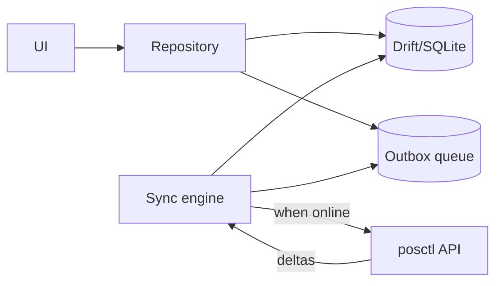

# 7 & 8 — Frontend (Web Console) and Flutter (Field App)

## 7. Web Operations Console

### 7.1 Stack (MANDATED)
- **React 19 + TypeScript + Vite**, **Material UI (MUI)** design system, **TanStack Query** (server
  state), **React Router**, **Axios** (HTTP), **React Hook Form + Zod** (forms/validation),
  **MUI X DataGrid/Charts** (enterprise tables & analytics), **i18next** (Amharic/English, RTL-safe).
- **Generated API client** from OpenAPI (`@posctl/api-client-ts` package) wrapping Axios → no
  hand-written fetch code, types always match the Spring Boot backend.
- Auth via **Keycloak OIDC** (`oidc-client-ts`/`react-oidc-context`, PKCE, silent refresh); access
  token in memory, refresh handled by the OIDC client. Route guards check permissions from `/me`.

### 7.2 Why Vite SPA (not SSR)
This is an internal, authenticated back-office behind Cloudflare Zero Trust — there is no SEO or
public-first-paint requirement that would justify SSR/Next.js. A **Vite SPA** is simpler to build,
host (static assets via the same ingress), and cache, and it is the **mandated** choice. Heavy
reporting tables are handled with server-side pagination + MUI DataGrid virtualization rather than
server rendering.

### 7.3 Folder structure (Vite, feature-sliced)
```
web/
├─ index.html
├─ vite.config.ts
├─ src/
│  ├─ app/                      # router, providers (QueryClient, MUI theme, OIDC), layout
│  ├─ features/                 # feature-sliced: one folder per domain
│  │  └─ merchant/
│  │     ├─ api/                # hooks over generated Axios client
│  │     ├─ components/
│  │     ├─ pages/              # MerchantsList, MerchantDetail, ...
│  │     ├─ hooks/
│  │     └─ types.ts
│  ├─ features/{device,deployment,kyc,tasks,workflow,analytics,health,admin}/
│  ├─ components/               # shared MUI-based UI primitives
│  ├─ lib/                      # auth(OIDC), queryClient, axios, i18n, rbac, format
│  ├─ routes.tsx                # React Router route tree + guards
│  └─ main.tsx
├─ public/
└─ tests/ (vitest + @testing-library + playwright e2e)
```

### 7.4 Cross-cutting
- **RBAC in UI:** `<Can permission="merchant:approve">` component hides/disables actions; the Spring
  Boot API is still the enforcement point.
- **Optimistic updates** via TanStack Query with rollback; `If-Match` version for conflict detection.
- **Live updates:** SSE channel feeds notifications + dashboard counters.
- **Accessibility & i18n** first-class (Amharic + English, RTL-safe MUI theme direction).
- **Design tokens** shared with Flutter via a small `@posctl/tokens` package (colors, spacing) →
  exported to an MUI theme and a Dart theme.
- **Role dashboards:** distinct home dashboards per persona (CEO/Exec, Operations, Sales, Call
  Center, Finance, Compliance, Support, Data Encoder) — see KPI definitions in
  [09-roadmap-team-deployment.md](09-roadmap-team-deployment.md) and RBAC in
  [10-rbac-matrix.md](10-rbac-matrix.md).

---

## 8. Flutter Field App

### 8.1 Purpose
Field agents deploy/swap terminals on site, often with poor connectivity. The app must be
**offline-first**, **camera-enabled** (serial/IMEI scan, evidence photos), and **GPS-aware**.

### 8.2 Stack
- **Flutter (stable) + Dart**, **Riverpod** (state), **go_router** (navigation), **Drift/SQLite**
  (offline store), **dio + retrofit** (generated from OpenAPI), **freezed/json_serializable**
  (models), **mobile_scanner** (barcode/IMEI), **geolocator**, **flutter_secure_storage** (tokens).
- Auth via **Keycloak OIDC** with `flutter_appauth` (PKCE), tokens in secure storage.

### 8.3 Offline-first sync (the core design challenge)

- All writes go to **local DB + a device-side outbox** first; UI is instant.
- A **sync engine** flushes the outbox when connectivity returns, using server **Idempotency-Key**
  so retries never double-apply (e.g., a deployment isn't completed twice).
- Conflict policy: server wins on reference data; field-captured evidence is append-only so it never
  conflicts. Assignment conflicts surface as a task for ops.
- Photos captured offline are stored locally, uploaded to MinIO via pre-signed URLs on reconnect.

### 8.4 Folder structure (Clean Architecture)
```
field_app/
├─ lib/
│  ├─ core/                     # config, di, network, error, theme, l10n
│  ├─ data/
│  │  ├─ datasources/ (remote: dio; local: drift)
│  │  ├─ models/                # freezed DTOs (generated)
│  │  └─ repositories/          # impl of domain repos
│  ├─ domain/
│  │  ├─ entities/
│  │  ├─ repositories/          # abstract
│  │  └─ usecases/
│  ├─ features/
│  │  ├─ auth/
│  │  ├─ deployments/           # today's route, complete deployment
│  │  ├─ devices/               # scan, swap, mark faulty
│  │  ├─ merchants/
│  │  └─ sync/                  # outbox + sync engine
│  └─ main.dart
├─ test/  integration_test/
└─ android/ ios/
```

### 8.5 Key field flows
1. **My route today** → list of planned deployments (cached, geo-sorted).
2. **Complete deployment** → scan device serial/IMEI → confirm branch (GPS check) → capture photos →
   submit (queued offline, idempotent).
3. **Swap / mark faulty** → scan old + new device → reason → evidence → queued.
4. **Quick follow-up** → log a call-center-style outcome from the field.

### 8.6 Shared with web
- Same OpenAPI contract → generated Dart client mirrors the TS client.
- Same design tokens (colors/typography) exported to a Dart theme file for brand consistency.
