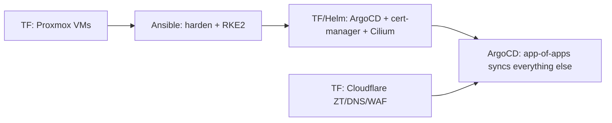
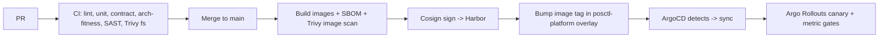

# 9, 10 & 19 — Kubernetes, Terraform, DevOps/GitOps, Repository Structure

## 9. Kubernetes Design

### 9.1 Cluster topology (on Proxmox)
- **3 Proxmox nodes** (ADR-009). On each: 1 control-plane VM + 1–2 worker VMs → a 3-master HA K8s.
- **K8s distribution decision** (brief asked to choose among K3s / RKE2 / kubeadm / MicroK8s):

  | Option | Pros | Cons | Verdict |
  |---|---|---|---|
  | MicroK8s | easy | Canonical-opinionated, weaker for fintech hardening | No |
  | K3s | lightweight, simple, great for edge/small | fewer CIS defaults | runner-up (use for `dev`) |
  | kubeadm | fully vanilla | most ops toil | No |
  | **RKE2** | **CIS-hardened by default, FIPS-capable, prod-grade, simple HA** | slightly heavier | **Yes (staging/prod)** |

  **Recommendation: RKE2** for staging/prod (security posture), K3s acceptable for `dev`.
- **CNI: Cilium** (eBPF, NetworkPolicy, Hubble observability).
- **Storage decision** (brief asked Longhorn vs Ceph vs NFS on Proxmox):

  | Option | Pros | Cons | Verdict |
  |---|---|---|---|
  | NFS | simple | single point of failure, poor for DB | No (backups only) |
  | Longhorn | easy k8s-native replicated block | overhead at scale, no native object | viable small-scale |
  | **Ceph** (Proxmox-integrated) | **unified block+object+fs, HA, scales, live migration** | ops complexity | **Yes** |

  **Recommendation: Ceph** (already the Proxmox HA storage from ADR-009) → CSI (`rook-ceph` or
  Proxmox CSI) for RWX/RWO PVCs; MinIO on top for S3 objects; NFS only as a tertiary backup target.
- **Ingress:** internal ingress-nginx, reachable **only** through the Cloudflare Tunnel
  (`cloudflared` Deployment) — no LoadBalancer with a public IP.
- **Namespace governance:** per-namespace **ResourceQuota** + **LimitRange**, **RBAC** (least
  privilege ServiceAccounts), **Pod Security Admission `restricted`**, default-deny NetworkPolicies.

### 9.2 Namespaces
```
app            # api, web, worker, cloudflared
data           # postgres (CloudNativePG), redis, minio
platform       # keycloak, vault, harbor
observability  # prometheus, grafana, loki, tempo, alertmanager
gitops         # argocd
cert-manager, ingress-nginx
```

### 9.3 Stateful services via operators (do NOT hand-roll StatefulSets)
| Service | Operator | Why |
|---|---|---|
| PostgreSQL | **CloudNativePG** | HA, failover, backups to MinIO/S3, PITR, replicas |
| Redis | **Redis Operator** (or Bitnami HA) | sentinel/cluster, persistence |
| MinIO | **MinIO Operator** | tenants, erasure coding, replication |
| Keycloak | **Keycloak Operator** | realm CRDs, HA |
| Vault | **Vault Helm** + raft | auto-unseal (transit), HA |
| Monitoring | **kube-prometheus-stack** | Prom+Grafana+Alertmanager |

### 9.4 Workload manifests (Kustomize, GitOps-managed)
```
deploy/
├─ base/
│  ├─ api/ (deployment, service, hpa, pdb, networkpolicy, servicemonitor)
│  ├─ web/
│  ├─ worker/
│  └─ cloudflared/
└─ overlays/
   ├─ dev/      (replicas=1, debug)
   ├─ staging/
   └─ prod/     (replicas=3, HPA, anti-affinity, resource limits)
```
Each app workload includes: **HPA** (CPU + custom RPS), **PodDisruptionBudget**, **resource
requests/limits**, **liveness/readiness/startup probes**, **topology spread** across nodes,
**NetworkPolicy** (default-deny + explicit allows), **ServiceMonitor** for Prometheus, and
**SecurityContext** (non-root, read-only FS, dropped caps).

### 9.5 Progressive delivery
- ArgoCD syncs manifests; **Argo Rollouts** does canary for `api`/`web` (10%→50%→100% with metric
  analysis gates on error rate + latency from Prometheus).
- DB migrations run as a **pre-sync Job**; rollout proceeds only on success.

---

## 10. Terraform Design

### 10.1 Split of responsibilities (challenging tool overlap)
- **Terraform = provision infrastructure**: Proxmox VMs, networks, Cloudflare DNS/Tunnel/Access/WAF,
  MinIO buckets, Keycloak realms/clients, Vault policies/mounts, Harbor projects.
- **Ansible = configure OS & bootstrap**: hardening (CIS), install RKE2, kernel params, node prep.
- **ArgoCD = deploy apps** (GitOps). TF/Ansible never deploy app workloads.

### 10.2 Providers
`telmate/proxmox` (or `bpg/proxmox`), `cloudflare`, `minio`, `keycloak`, `vault`, `harbor`,
`kubernetes`/`helm` (only for cluster add-ons that must exist before ArgoCD, e.g. ArgoCD itself).

### 10.3 Structure (remote state, per-environment, modules)
```
infra/terraform/
├─ modules/
│  ├─ proxmox-vm/
│  ├─ rke2-cluster/
│  ├─ cloudflare-zerotrust/   # tunnel, access apps, WAF rules, DNS
│  ├─ minio-tenant/
│  ├─ keycloak-realm/
│  ├─ vault-bootstrap/
│  └─ harbor-project/
├─ environments/
│  ├─ dev/    (main.tf, backend.tf, terraform.tfvars)
│  ├─ staging/
│  └─ prod/
└─ global/                    # cloudflare zone, dns, org-level
```
- **State backend:** MinIO (S3-compatible) with state locking via DynamoDB-compatible (or use
  Terraform Cloud-less locking via `pg` backend on the management DB). Encrypt state; restrict access.
- **Secrets into TF** come from Vault (never plaintext tfvars for secrets).

### 10.4 Bootstrap order


---

## 19. Repository & GitHub Strategy

### 19.1 Repo strategy — recommendation: **two repos, not a sprawl of microrepos, not one giant monorepo**
- **`posctl` (polyglot app monorepo)** — backend (Spring Boot/Maven modular monolith), web
  (React/Vite), flutter, and the `contracts` package (OpenAPI + event schemas) from which the TS and
  Dart clients are generated. One PR can change a contract and both consumers atomically. JS/TS parts
  use pnpm + Turborepo; the Java backend builds with Maven; a top-level Makefile/Turbo orchestrates.
- **`posctl-platform` (GitOps + IaC repo)** — Terraform, Ansible, Kustomize/Helm, ArgoCD app-of-apps.
  Separated because infra changes have a different review/approval gate and blast radius than app code.

> Challenge: the brief's microservices instinct implies many repos. With a modular monolith, **one
> app monorepo is strictly better** — atomic cross-cutting changes, shared CI, no version-skew hell.
> Split into more repos only when you extract a service (then it gets its own repo + pipeline).

### 19.2 App monorepo layout
```
posctl/
├─ apps/
│  ├─ api/                       # Spring Boot 3.x modular monolith (Maven)
│  │  ├─ pom.xml                 # parent; Spring Modulith, JPA, Security, Flyway, MapStruct
│  │  └─ src/main/java/com/santimpay/posctl/
│  │     ├─ identity/  merchant/  inventory/  deployment/
│  │     ├─ kyc/  tasks/  workflow/  followup/
│  │     ├─ analytics/  notification/  health/  ai/
│  │     ├─ shared/              # kernel: ids, outbox, audit, eventbus, base classes
│  │     └─ PosctlApplication.java
│  ├─ web/                       # React + Vite + MUI (see doc 05)
│  └─ field_app/                 # Flutter (see doc 05)
├─ packages/
│  ├─ contracts/                 # OpenAPI 3.1 + JSON Schema events (source of truth)
│  ├─ api-client-ts/             # generated (openapi-generator -> Axios)
│  ├─ api-client-dart/           # generated (openapi-generator -> dio)
│  └─ tokens/                    # design tokens
├─ db/                           # Flyway migrations + schema.sql
├─ tools/                        # codegen, scripts
├─ .github/workflows/
├─ turbo.json  pnpm-workspace.yaml
```

### 19.3 Per-module backend layout (Spring Modulith + Clean/Hexagonal — same shape every module)
Each module is a Spring Modulith **application module** (a Java package). Public API is only what is
exposed in the module root package + published events; everything else lives in sub-packages that
Spring Modulith treats as internal.
```
com/santimpay/posctl/merchant/
├─ domain/         # @Entity aggregates, value-objects, domain events (POJOs, no Spring)
├─ application/    # use-cases / @Service command & query handlers, ports (interfaces)
├─ infrastructure/ # Spring Data JPA repositories, MapStruct mappers, external clients (ACL)
├─ web/            # @RestController, request/response DTOs, springdoc annotations
├─ events/         # published domain events (the module's integration contract)
└─ MerchantModule.java   # module config; named interfaces / allowed dependencies
```
A CI **architecture-fitness test** runs **Spring Modulith `ApplicationModules.of(App.class).verify()`**
plus ArchUnit rules: `domain` depends on no Spring/JPA-web; no module reaches another module's
`domain`/`infrastructure` — only its published `application` interface or `events`. This is what keeps
the monolith *modular* and makes extraction mechanical. `spring-modulith-docs` auto-generates the
C4 component docs and the module dependency diagram from the code.

### 19.4 Branching strategy — **Trunk-Based Development**
- Short-lived feature branches → PR → merge to `main` behind feature flags.
- `main` is always deployable; tags `vX.Y.Z` trigger prod promotion via GitOps.
- Environments are branches of *config* in the platform repo (overlays), not of code.
- Protected `main`: required reviews, status checks (lint, test, contract, security scan), signed
  commits, linear history.

### 19.5 GitHub organization
```
org: santimpay
├─ teams: platform, backend, frontend, mobile, security, data-ai, qa
├─ repos: posctl (app), posctl-platform (infra/gitops), posctl-docs
├─ org policies: required 2FA, SSO, branch protection, CODEOWNERS, Dependabot,
│                secret scanning + push protection, signed commits
└─ environments (GH): dev (auto), staging (auto), prod (manual approval gate)
```

### 19.6 CI/CD (GitHub Actions) → GitOps (ArgoCD)

- **Self-hosted runners:** GitHub Actions runs on **self-hosted runners** via **Actions Runner
  Controller (ARC)** in the cluster (ephemeral, auto-scaled pods) — keeps build secrets and registry
  access inside the private network, no cloud runners. GHCR may mirror public base images; **Harbor
  is the authoritative private registry**.
- **Image registry:** Harbor (with Trivy scanning + Cosign signature verification admission policy).
- **No `kubectl apply` from CI** — CI only updates Git; ArgoCD is the sole deployer (true GitOps).
- **Pipeline structure (`.github/workflows/`):** `ci.yml` (PR checks), `build-release.yml`
  (images+sign on main/tags), `db-migrate-check.yml`, `iac.yml` (TF plan on PR, apply on main in
  platform repo), `security.yml` (scheduled Trivy/Dependabot/secret scan).

### 19.6b Cross-cutting data decisions the brief asked for
- **Multi-tenancy:** This is a **single-tenant internal platform** (SantimPay's own staff operate it;
  merchants are *data*, not tenants). So **no row-level multi-tenancy is needed**. Regional data
  isolation is handled by **RBAC region scoping** (see [10-rbac-matrix.md](10-rbac-matrix.md)), not by
  tenant partitions. If a white-label/B2B2B future arrives, add a `tenant_id` discriminator + Postgres
  RLS policies — the schema's UUID keys make this additive.
- **Event sourcing:** **Rejected as the global persistence model** (a classic fintech over-engineering
  trap). Use **state-stored aggregates + transactional outbox domain events + immutable audit_log +
  targeted history tables**. This delivers the auditability/replay benefits people *want* from event
  sourcing without the projection/versioning tax. Revisit only for a specific aggregate that truly
  needs full temporal reconstruction.
- **Data warehouse / BI:** Phase 1 = read replica + materialized views + reporting views (good to
  tens of millions of rows). Phase 2 (if analytical volume explodes) = CDC (Debezium) → columnar
  store (DuckDB/ClickHouse) for OLAP, keeping OLTP clean. Don't build the warehouse before the
  materialized views are the bottleneck.

### 19.7 Secrets management
- **Vault** is the secret source. Kubernetes pulls secrets via **External Secrets Operator**
  (Vault backend) → native `Secret` objects, rotated automatically.
- **Dynamic DB credentials**: app gets short-TTL Postgres creds from Vault, no static DB passwords.
- **No secrets in Git** ever; gitleaks + GH push protection enforce it. SOPS+age only for the very
  few bootstrap secrets ArgoCD needs before Vault is reachable.
