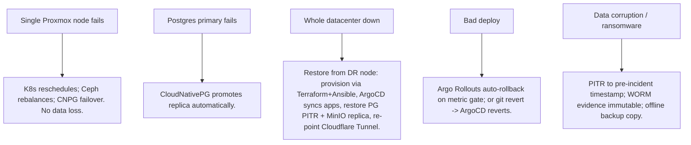

# 11, 12, 13 & 14 — Security, Monitoring, Backup, Disaster Recovery

## 11. Security Design

### 11.1 Defense-in-depth layers
1. **Edge (Cloudflare):** WAF (OWASP ruleset + custom), DDoS protection, bot management, rate
   limiting, geo rules. **Zero Trust Access** in front of the web console and admin endpoints —
   device posture + SSO + per-app policies. **Tunnel** means **zero open inbound ports**.
2. **Network:** default-deny Cilium NetworkPolicies; data namespace reachable only from app;
   internal **mTLS** via Vault PKI; private cluster, no public IPs.
3. **Identity (Keycloak):** OIDC/OAuth2, MFA (TOTP/WebAuthn) mandatory for staff, brute-force
   detection, short access-token TTL + refresh rotation, separate realms for staff vs service
   clients.
4. **Authorization (app):** RBAC roles + fine-grained `resource:action` permissions checked on every
   mutating call; row-level scoping by region/assignment where relevant; deny-by-default.
5. **Data:**
   - TLS everywhere (in transit), Ceph encryption at rest, Postgres TDE-equivalent via encrypted
     volumes.
   - **Field-level encryption of PII** (national IDs, KYC docs metadata) via **Vault Transit**
     (encryption-as-a-service) — app never holds the keys.
   - KYC evidence in MinIO buckets with **object-lock (WORM)** + retention policy.
   - **Immutable audit log** (`audit.audit_log`, UPDATE/DELETE revoked) + per-aggregate history.
6. **Supply chain:** Trivy scans (fs + image) in CI, SBOM generation, **Cosign** image signing,
   ArgoCD/admission verifies signatures, Dependabot, GH secret scanning + push protection, pinned
   base images.
7. **Secrets:** Vault + External Secrets Operator; dynamic short-TTL DB creds; no static secrets.
8. **Runtime:** non-root containers, read-only root FS, dropped Linux capabilities, seccomp,
   Pod Security Admission `restricted`, **Falco** (or Tetragon/Cilium) for runtime threat detection.

### 11.2 Compliance posture
- Scope-limiting decision (ADR-006): platform handles **no card data / no money movement**, so it is
  **out of PCI-DSS cardholder-data scope** — a major risk reduction. It still treats KYC/PII as
  regulated data (data-protection controls above).
- Audit trail + data retention + right-to-erasure procedure documented; least-privilege access
  reviews quarterly.

### 11.3 Threat model highlights (STRIDE, abbreviated)
| Threat | Control |
|---|---|
| Spoofing | Keycloak MFA, mTLS, signed tokens |
| Tampering | Immutable audit, signed images, WORM evidence |
| Repudiation | Per-action audit with actor + request_id |
| Information disclosure | Field encryption, RBAC, network policy, ZT |
| DoS | Cloudflare WAF/rate limit, HPA, PDB |
| Elevation of privilege | Deny-by-default authZ, PSA restricted, no static admin creds |

---

## 12. Monitoring & Observability Design

### 12.1 Stack (Grafana ecosystem — coherent, self-hosted)
- **Metrics:** Prometheus (kube-prometheus-stack) + app `/metrics` (RED + USE method).
- **Logs:** Loki + Promtail/Alloy; structured JSON logs with `request_id`/`trace_id` correlation.
- **Traces:** Tempo + OpenTelemetry SDK in api/worker (auto + manual spans across modules/events).
- **Dashboards & alerting:** Grafana + Alertmanager (→ Slack/Telegram/email/on-call).
- **Network/runtime:** Cilium Hubble (flows), Falco (runtime).

### 12.2 The three pillars wired together
Every request carries `X-Request-Id` → injected into logs, propagated as the OTel trace id → audit
rows store it. From a Grafana alert you can pivot log↔trace↔metric for the same request.

### 12.3 SLOs (define, measure, alert)
| Service | SLI | SLO |
|---|---|---|
| API | availability | 99.9% monthly |
| API | p95 latency (reads) | < 300 ms |
| API | p95 latency (writes) | < 600 ms |
| Sync (Flutter) | outbox flush success | > 99.5% within 5 min of connectivity |
| Deployment ingest | event lag | < 30 s p95 |
| DB | replication lag | < 5 s |

### 12.4 Key dashboards & alerts
- Golden signals per service (rate/errors/duration/saturation).
- Business dashboards (from `analytics` MVs): deployments completed today, fleet status, KYC backlog,
  merchant health distribution, employee productivity.
- Alerts: error-rate burn-rate (multiwindow), DB replication lag, disk/Ceph capacity, certificate
  expiry, outbox backlog growth, failed ArgoCD syncs, Falco criticals, backup job failures.

---

## 13. Backup Design

### 13.1 What gets backed up
| Asset | Method | Frequency | Retention |
|---|---|---|---|
| PostgreSQL | CloudNativePG continuous **WAL archiving** + base backups to MinIO | continuous + daily base | 35 days PITR, 12 monthly |
| MinIO objects (KYC/attachments) | bucket **replication** to DR node + versioning + object-lock | continuous | per legal retention |
| Vault | raft snapshots | hourly | 30 days |
| Keycloak realms | TF-managed (recreatable) + DB backup | with PG | — |
| K8s state | all in Git (GitOps) → cluster is reproducible | on commit | full history |
| Configs/IaC | Git | on commit | full history |

### 13.2 Principles
- **3-2-1 rule:** ≥3 copies, 2 media, 1 off-site (the DR node / separate physical location).
- **Point-in-time recovery** for Postgres (any second within retention).
- **Backups are encrypted** and their restore is **tested monthly** (a backup you haven't restored is
  a hope, not a backup).
- GitOps means the *platform* needs no backup — only **stateful data** does. This is a deliberate
  simplification the architecture buys you.

---

## 14. Disaster Recovery Design

### 14.1 Objectives
| Tier | RPO | RTO |
|---|---|---|
| Database (OLTP) | ≤ 5 min (WAL) | ≤ 1 hour |
| Object store (KYC) | near-zero (replicated) | ≤ 1 hour |
| Whole platform | ≤ 15 min | ≤ 4 hours |

### 14.2 Failure scenarios & response

### 14.3 DR runbook (datacenter loss) — summary
1. Declare DR; freeze writes at edge (Cloudflare).
2. `terraform apply` the `dr` environment on the standby node/site → VMs.
3. Ansible bootstraps RKE2; ArgoCD installed.
4. ArgoCD app-of-apps syncs all workloads from Git.
5. Restore PostgreSQL via CloudNativePG from MinIO WAL/base to chosen PITR.
6. Verify MinIO replica is primary; verify Vault unseal (transit auto-unseal or recovery keys).
7. Re-point Cloudflare Tunnel/DNS to DR ingress; run smoke tests; lift write freeze.

### 14.4 DR governance
- **Quarterly DR game-day** with timed RTO/RPO measurement.
- Documented, version-controlled runbooks in `posctl-platform/runbooks/`.
- On-call rotation + escalation policy; incident postmortems are blameless and tracked.
