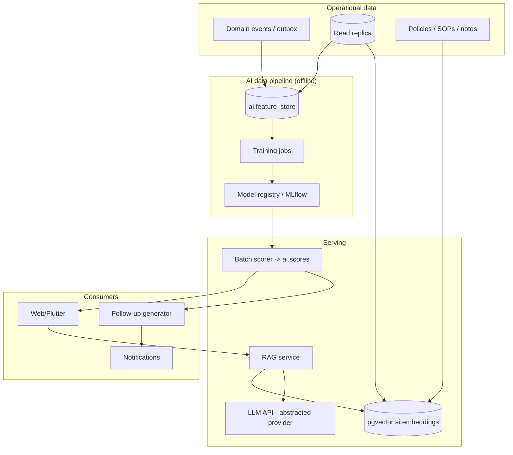

# 15 — AI Architecture

> Guiding principle (ADR-010): **AI is additive and decoupled.** The `ai` module reads events and
> replicas; it is never in the critical write path. Ship value cheaply first (batch scoring + thin
> RAG), defer expensive choices (self-hosted LLM, dedicated vector DB) until evidence demands them.

## 15.1 Maturity phases (challenge the "do everything now" instinct)

| Phase | Capability | Tech | Why now/later |
|---|---|---|---|
| **0 — Data foundation** | event capture, feature store, labels | outbox → `ai.feature_store`, `analytics` MVs | Nothing useful without clean data |
| **1 — Batch scoring** | Merchant Risk, Health, Sales Performance, POS Failure Prediction | scheduled jobs, gradient-boosted trees (XGBoost/LightGBM), results → `ai.scores` | High ROI, explainable, cheap, no realtime infra |
| **2 — RAG assistant** | Ops Q&A over policies + operational data, AI reporting summaries | pgvector + external LLM API behind abstraction | Useful, bounded cost, no model hosting |
| **3 — Automation** | Auto follow-up generation, workflow automation, anomaly alerts | event-triggered LLM + rules, human-in-the-loop | Build trust before autonomy |
| **4 — Agents (future)** | multi-step AI agents (tool-using) for ops tasks | agent framework + guarded tools | Only after 1–3 are reliable |

## 15.2 Reference architecture

## 15.3 The scoring models (Phase 1 detail)
- **Merchant Risk Score** — features: KYC completeness, ownership, txn volatility, chargeback/failure
  rates, geography, tenure. Output band low/med/high → drives review priority & limits.
- **Merchant Health Score** — engagement, txn trend, device uptime, follow-up sentiment → churn early
  warning, surfaced on merchant overview.
- **Sales Performance Score** — per-merchant/branch/agent throughput vs cohort → targets & coaching.
- **POS Failure Prediction** — device telemetry (firmware, fault history, age, connectivity) →
  probability of failure in N days → proactive swap tasks.
- All models: **explainable** (SHAP values stored in `ai.scores.features`), **versioned**
  (`model_version`), **monitored for drift**, **human-overridable**. Start with interpretable
  tree models, not deep nets.

## 15.4 RAG architecture (Phase 2)
- **Ingestion:** policies/SOPs + selected operational records → chunked → embedded → `ai.embeddings`
  (pgvector, HNSW index). Re-embed on change via events.
- **Retrieval:** hybrid (pgvector cosine + `pg_trgm`/keyword) → rerank → context window.
- **Generation:** LLM behind a provider-abstraction port (`LlmPort`) so the provider is swappable;
  responses include **citations** to source rows/docs; conversations stored in `ai.conversations`.
- **Guardrails:** every AI answer is **read-scoped to the user's permissions** (no leaking data the
  user can't see), PII redaction on egress, prompt-injection filtering, and grounded-only answers
  (refuse when retrieval confidence is low).

## 15.5 LLM hosting decision (explicit challenge)
- **Default: external LLM API** behind `LlmPort`. Self-hosting (vLLM + open-weights on a GPU node)
  is **deferred** until *data-residency law* or *cost at scale* justifies the GPU capex + MLOps
  burden. The abstraction means switching is a config change, not a rewrite.
- Vector store stays **pgvector** until it is provably the bottleneck (then evaluate Milvus/Qdrant).
  Don't add a database product for a feature you haven't shipped.

## 15.6 Automation & future agents (Phases 3–4)
- **Auto follow-up generation:** on `RiskScoreComputed`/health drop/KYC stale → generate a draft
  follow-up + task, **human approves before send** initially.
- **Workflow automation:** rules + LLM classification route approvals, prioritize tasks.
- **AI reporting:** natural-language summaries of dashboards, scheduled to managers.
- **Agents (future):** tool-using agents with a **constrained tool registry** (read APIs + propose
  actions that require human/approval-workflow confirmation). Strict audit of every agent action via
  the same `audit_log`. Autonomy is earned incrementally.

## 15.7 MLOps
- Feature/label pipelines reproducible; **MLflow** for experiment tracking + registry; models
  packaged as container jobs deployed by the same GitOps flow; drift & performance monitored in
  Grafana; retraining scheduled and gated on evaluation metrics.
