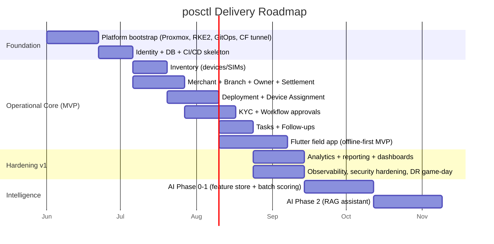

# 16, 17, 18 & 20 — Roadmap, Sprint Plan, Team Structure, Production Deployment Guide

## 16. Development Roadmap



**Milestones**
- **M0 — Platform ready (wk 5):** cluster, GitOps, identity, CI/CD, one hello-world service in prod.
- **M1 — Operational MVP (wk ~12):** onboard merchant → KYC → activate → deploy device → task/follow-up,
  on web + Flutter. *This is the demo that proves the system.*
- **M2 — Production v1 (wk ~24):** analytics, reporting, full security/observability/DR, SLOs met.
- **M3 — Intelligence (wk ~36):** scoring live and surfaced; RAG assistant in beta.

## 17. Sprint Plan (2-week sprints; first ~8 sprints)

| Sprint | Theme | Key deliverables | Definition of Done |
|---|---|---|---|
| **S1** | Platform bootstrap | Proxmox cluster, RKE2, Cilium, Ceph, ArgoCD, Cloudflare Tunnel, Harbor, Vault, Keycloak | App-of-apps syncs; private ingress works; no open ports |
| **S2** | Backbone | DB cluster (CNPG), schema v1, outbox+eventbus, auth (Keycloak OIDC), CI/CD + image signing, observability stack | Authn works end-to-end; metrics/logs/traces flowing; migrations in CI |
| **S3** | Inventory | Devices + SIMs CRUD, lifecycle state machine, bulk import, audit | API + web screens; tests; arch-fitness green |
| **S4** | Merchant | Merchant/owner/branch/settlement, search, soft-delete, history | Onboard flow (pre-KYC) on web |
| **S5** | KYC + Workflow | KYC state machine + history, document upload (MinIO presign), approval workflow engine | Merchant can be approved & activated via workflow |
| **S6** | Deployment | Daily deployment, device assignment (temporal, exclusion constraint), evidence | Plan→complete deployment on web |
| **S7** | Flutter MVP | Offline-first field app: route, complete deployment, scan, photos, sync engine | Field flow works offline→sync; idempotent |
| **S8** | Tasks/Follow-ups + Analytics start | Tasks, follow-ups, first MVs/dashboards, notifications + SSE | KPI dashboard live; assignment + follow-up loop |

(Backlog continues: reporting/export, security hardening, DR game-day, AI phases.)

**Agile mechanics:** trunk-based dev + feature flags, PR review by CODEOWNERS, demo each sprint,
retro, DORA metrics tracked (deploy freq, lead time, MTTR, change-fail rate).

## 18. Team Structure

### 18.1 Recommended team (lean, matched to a modular monolith)
| Role | Count (Y1) | Focus |
|---|---|---|
| Engineering Lead / Architect | 1 | Boundaries, ADRs, reviews |
| Backend engineers | 2–3 | Modules, API, events |
| Frontend engineer | 1–2 | Web console |
| Flutter engineer | 1 | Field app |
| Platform/DevOps engineer | 1 | Proxmox/K8s/GitOps/IaC |
| QA / SDET | 1 | Test automation, contract tests |
| Data/AI engineer | 1 (from M2) | Feature store, scoring, RAG |
| Product owner | 1 | Backlog, stakeholders |
| (Shared) Security | 0.5 | Reviews, threat modeling |

> **Challenge:** the brief's tooling implies a 15+ person platform org. The modular-monolith choice
> is precisely what lets a **6–8 person core team** ship and run this. Scale the team when you
> *extract services*, not before.

### 18.2 Team topologies
- **Stream-aligned** feature team owns vertical slices (merchant, deployment, etc.).
- **Platform team (1–2)** provides the golden path (CI/CD, GitOps, observability as paved road).
- **Enabling** security function reviews and coaches. Conway's Law: the monolith's clean module
  seams let one team own multiple modules without a service per person.

---

## 20. Production Deployment Guide

### 20.1 Prerequisites
- 3× Proxmox VE nodes (Ubuntu 24.04 LTS guests), + 1 DR node (separate power/network).
- Ceph configured across the 3 nodes (or ZFS + replication).
- Cloudflare account: zone, Tunnel token, Zero Trust, WAF, DNS API token.
- GitHub org `santimpay` with the two repos and Actions enabled.
- Domains: `app.posctl.santimpay.*`, `api...`, `id...` (Keycloak), `grafana...` (ZT-protected).

### 20.2 Step-by-step bring-up (idempotent, reproducible)
```bash
# 1. Provision infrastructure (VMs, Cloudflare, registries) — from posctl-platform repo
cd infra/terraform/environments/prod
terraform init && terraform plan -out tfplan && terraform apply tfplan

# 2. Configure OS + install RKE2 (HA control plane) + harden (CIS)
cd ../../../ansible
ansible-playbook -i inventories/prod site.yml      # hardening, RKE2, kernel, node prep

# 3. Bootstrap cluster add-ons that must precede ArgoCD
kubectl apply -k bootstrap/   # cilium, cert-manager, sealed bootstrap secret, argocd

# 4. Hand over to GitOps — ArgoCD app-of-apps owns everything else
kubectl apply -f gitops/app-of-apps.yaml
#    ArgoCD now syncs: cloudflared, keycloak, vault, harbor, CNPG, redis, minio,
#    observability stack, external-secrets, and the app (api/web/worker).

# 5. Initialize Vault (one-time) + configure auto-unseal + policies/PKI/db engine
vault operator init ; # store recovery keys offline; configure transit auto-unseal

# 6. Seed identity: Keycloak realm + roles + first admin (TF keycloak module)
#    Seed DB reference data via a migration Job.

# 7. Verify
kubectl get pods -A
argocd app list
#    smoke tests: login, onboard test merchant, complete a test deployment.
```

### 20.3 Pre-go-live checklist
- [ ] No public inbound ports (verify firewall + only cloudflared egress).
- [ ] MFA enforced for all staff in Keycloak.
- [ ] Default-deny NetworkPolicies applied; data ns isolated.
- [ ] Backups running (CNPG WAL to MinIO) **and a test restore completed**.
- [ ] DR game-day run; RTO/RPO measured against targets.
- [ ] Image signing + admission verification active; Trivy gates passing.
- [ ] SLO dashboards + burn-rate alerts wired to on-call.
- [ ] Audit log immutability verified (UPDATE/DELETE denied).
- [ ] PII field encryption (Vault transit) verified on KYC data.
- [ ] Load test at 2× year-1 peak passed.
- [ ] Runbooks + on-call rotation published.

### 20.4 Day-2 operations
- **Deploys:** merge to `main` → image built/signed → tag bump in platform repo → ArgoCD canary.
  Rollback = `git revert` (ArgoCD reconciles) or Argo Rollouts auto-abort on metric gate.
- **Scaling:** HPA handles app load; scale Proxmox/worker VMs via Terraform when saturation alerts
  fire; add PG read replicas for analytics growth.
- **Patching:** monthly OS patch via Ansible (rolling, drained nodes); RKE2 upgrades node-by-node;
  dependency updates via Dependabot PRs.
- **Capacity reviews:** monthly against the scale table; **service-extraction review** quarterly
  against the ADR-001 triggers.
```
```
